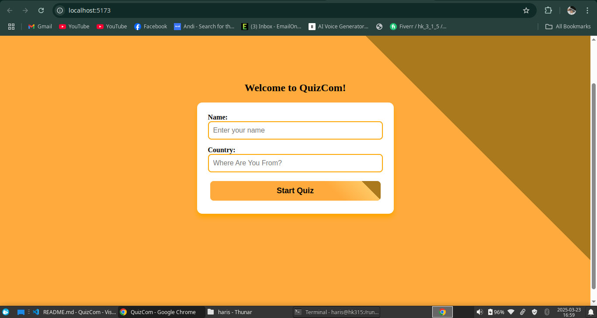
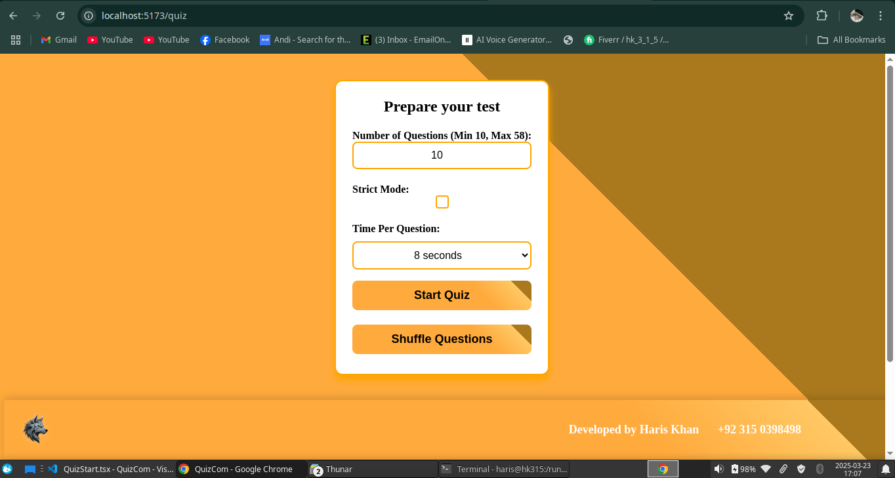
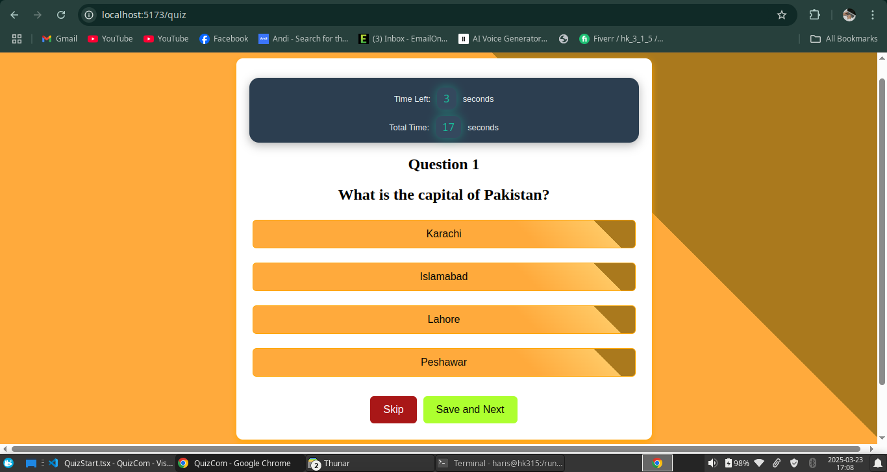

# 📚 React Quiz App  

A simple yet engaging **MCQ-based quiz application** built during the early stages of my **React journey**. This is my second React project, designed to enhance the user experience with multiple quiz customization options.  

🔗 **Live Demo**: [**Coming Soon**](#) *(Replace with your actual URL)*  

---

## ⚡ Features  

- ⚙️ **Customizable MCQs Count** – Choose how many questions you want to attempt.  
- ⟳ **Shuffle Mode** – Randomizes the order of MCQs so you get a fresh experience every time.  
- ⏳ **Timer Option** – Set a custom time limit per question to challenge yourself.  
- ⏭ **Skip for Now** – Skip questions and revisit them at the end.  
- 🔒 **Strict Mode** – Enables strict rules where answers are submitted immediately, preventing second chances.  

---

## 🛠️ Tech Stack  

- ⚛ **React** – Frontend framework  
- 📜 **JavaScript (ES6+)** – Core logic  
- 🎨 **CSS** – Styling  

---

## 📷 Screenshots  
[]((https://twear-web.surge.sh))

[]((https://twear-web.surge.sh))

[]((https://twear-web.surge.sh))
## 🏗 Setup & Installation  

1. Clone the repository:  
   ```bash
   git clone https://github.com/yourusername/quiz-app.git
   cd quiz-app
2. Install dependencies:

    ```bash
    npm install
3. Start the development server:
    ```bash
    npm run dev
  